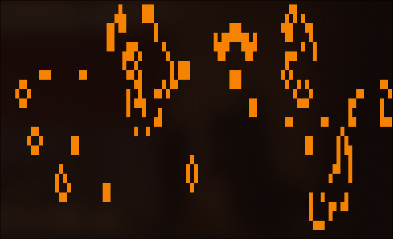

# Go Game of Life



A terminal-based implementation of Conway's Game of Life with configurable cellular automata rules, written in Go.

## Installation

```bash
git clone git@github.com:make0x20/go-of-life.git
cd go-of-life
sudo make install # Builds the binary (named 'gol') and moves it to /usr/bin folder
```

## Usage

Run with default Conway's Game of Life rules:
```bash
gol
```

Or specify custom rules using flags:
```bash
gol -neighborhood=3 -survival="13,14,15,16" -birth="10,11,12,13" -speed=100
```

## Command-line Flags

- `-neighborhood`: Neighborhood size (default: 1 for Conway's Game of Life)
- `-cell`: Cell character (default: █)
- `-speed`: Speed in milliseconds (default: 50)
- `-populate`: Population chance 0.0-1.0 (default: 0.2)
- `-survival`: Comma-separated survival neighbor counts (default: 2,3)
- `-birth`: Comma-separated birth neighbor counts (default: 3)

## Examples

### Conway's Game of Life (default)
```bash
gol
# or explicitly:
gol -neighborhood=1 -survival="2,3" -birth="3"
```

### Neighborhood Size 2 Rules
```bash
gol -neighborhood=2 -speed=100 -survival="6,7" -birth="6,7,8,9"
```

### Neighborhood Size 3 Rules
```bash
gol -neighborhood=3 -survival="13,14,15,16" -birth="10,11,12,13"
```

## Controls

- `q` - Quit the program

## Building from Source

```bash
git clone git@github.com:make0x20/go-of-life.git
cd go-of-life
make build
```
